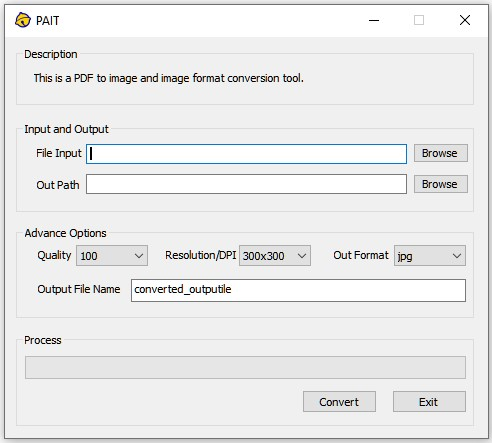
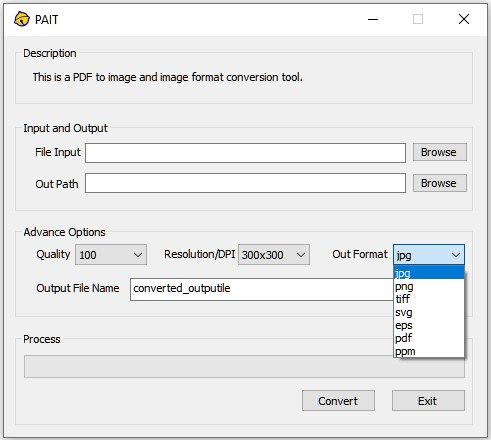
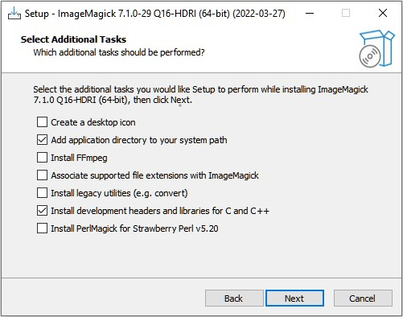

# PDF-AND-IMAGE-TOOLS
A tool for converting between PDF to image and image formats.
## Introduction
The core function of the software is implemented based on ImageMagick's Magick++, and the graphical interface is based on the MFC framework. Its main function is to achieve high-quality conversion between PDF to image and image formats.

### This is an impromptu rough little program, the code is badly written, and the functions can only be used as needed.

## PDF Convert to Image
Input a PDF file, set the output resolution and format, click convert to convert PDF to image.

## Image format conversion
Support mutual conversion between various commonly used image formats.

# Installation guide
Step1. Download the installation package from PDF-AND-IMAGE-TOOLS/BYCPLUSPLUS/PAIT/PAIT-Installer/PAIT-Installer.msi and install it.
Step2. Download ImageMagick installation package from PDF-AND-IMAGE-TOOLS/BYCPLUSPLUS/PAIT/SourceFiles/ImageMagick-7.1.0-29-Q16-HDRI-x64-dll.exe or https://imagemagick.org/script/download.php#windows and install it. Please check the "Add application directory to your system path" and "Install development headers and libraries for C and C++" options when installing.

Step3. Running.
