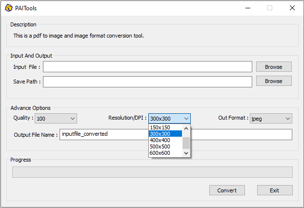

# PAITools ( PDF And Image Tools)
A tool for converting between PDF to image and image formats.
## Introduction
The core function of the software is implemented based on [ImageMagick's Magick++](https://imagemagick.org/script/magick++.php), and the graphical interface is based on the [MFC framework](https://docs.microsoft.com/en-us/cpp/mfc/framework-mfc?view=msvc-170). Its main function is to achieve high-quality conversion between PDF to image and image formats.

#### This is an impromptu rough little program, the code is badly written, and the functions can only be used as needed.
 

## PDF Convert to Image
Input a PDF file, set the output resolution and format, click convert to convert PDF to image.

## Image format conversion
Support mutual conversion between various commonly used image formats.

## Installation guide
Step1. Download the installation package from [PDF-AND-IMAGPAIToolsSetup/Release/PAIToolsSetup.msi]([https://github.com/Dot4diw/PDF-AND-IMAGE-TOOLS/blob/main/BYCPLUSPLUS/PAIT/PAIT-Installer/PAIT-Installer.msi](https://github.com/Dot4diw/PAITools/blob/main/PAIToolsSetup/Release/PAIToolsSetup.msi)) and install it.

Step2. Download ImageMagick installation package from https://imagemagick.org/script/download.php#windows and install it. Please check the "Add application directory to your system path" and "Install development headers and libraries for C and C++" options when installing.

Step3. Install the Ghostscript from https://www.ghostscript.com/.

Step4. Running.

## Note: 
*1). The path and output file name do not support Chinese, please enter the English path and the name.*

*2). PDF to image only supports single page pdf.*
## Updata
*1). Redesigned program interface.*

*2). Automatically recognize and automatic fill the output file path.*

*3). Fix some known bugs*
